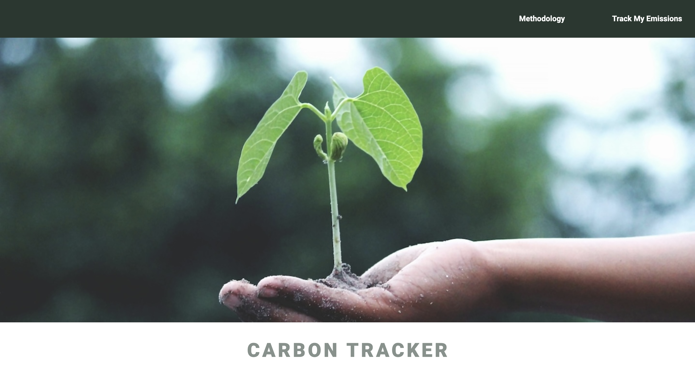

# CARBON FOOTPRINT TRACKER

The Carbon Footprint Tracker aims to drive environmental sustainability, creating greater awareness about how our lifestyle choices, as simple as the mode of transportation and the make of vehicle chosen, impacts our planet.

This tracker takes into account the user's selected make and model of vehicle, as well as the distance travelled (in km), churning out an estimated amount of carbon emitted (in kg).

In the app, users will have an overview of their total mileage and carbon emission. If it is of any interest to the users, links to explore emission reduction projects to offset their carbon footprint is available on the app as well.

# Screenshot

# Technologies Used

- JavaScript
- HTML
- CSS

# Getting Started

[Click to Play Connect Four!](your deployment url here)

# Next Steps

- Future enhancement one...
- Future enhancement two...
