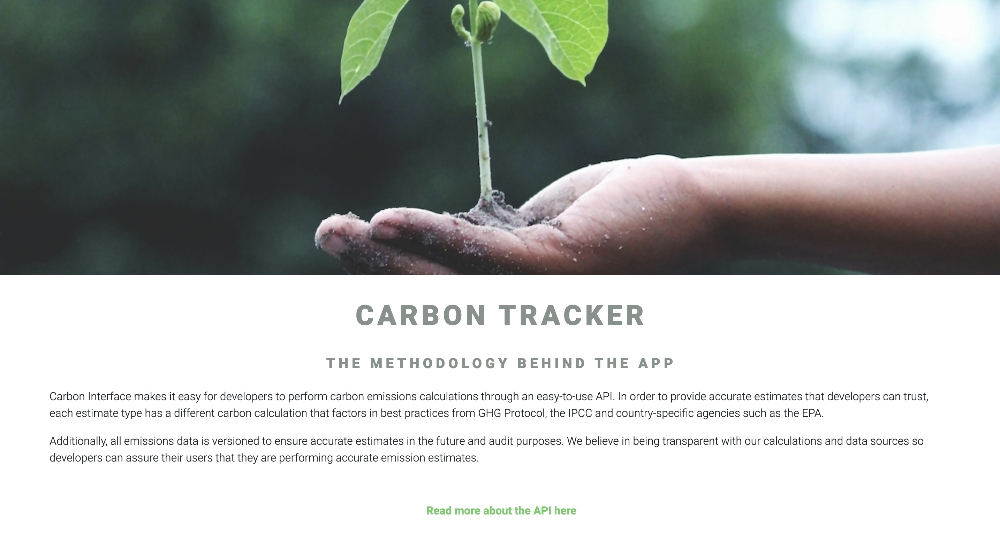
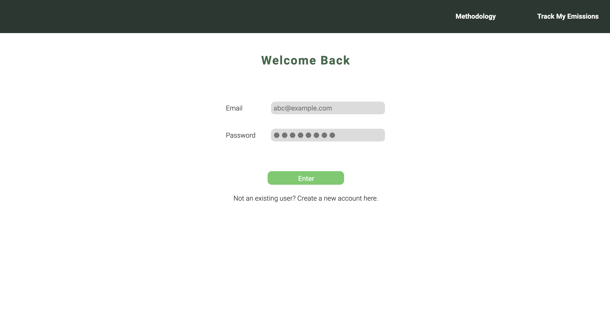
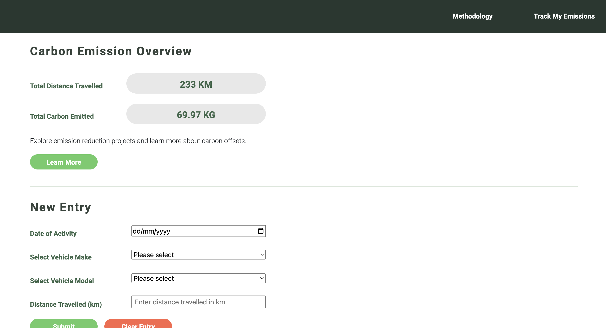
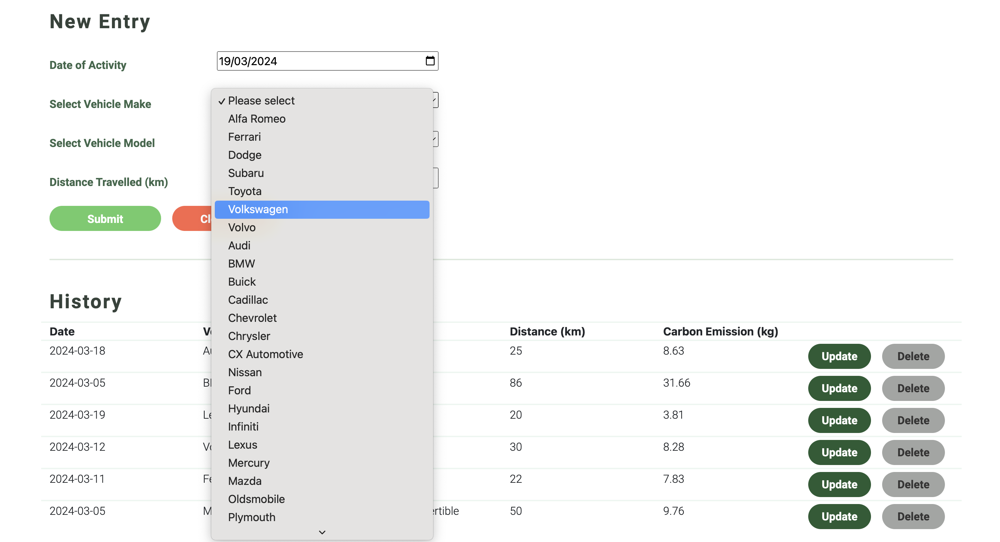
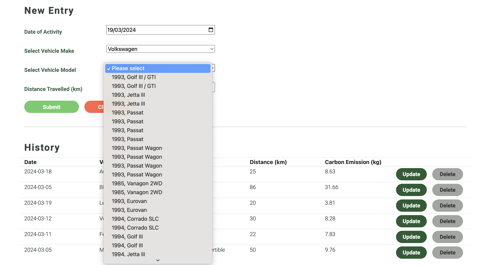
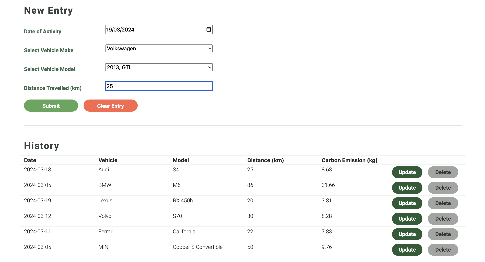
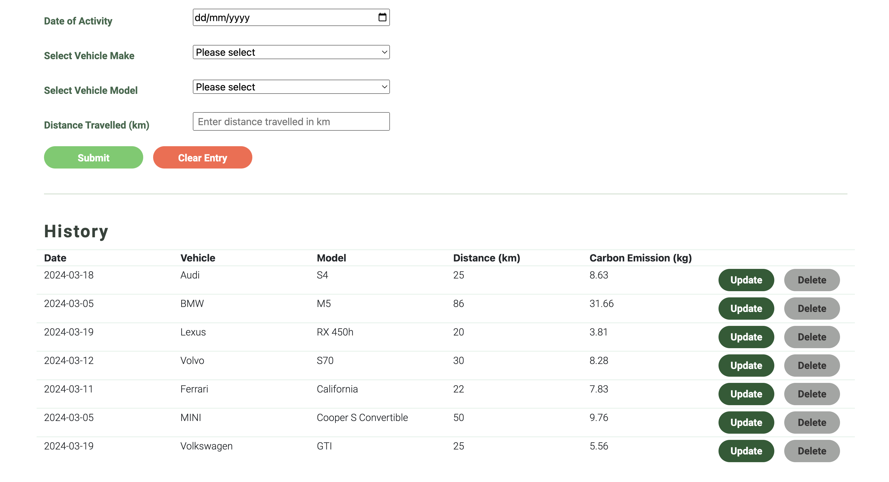
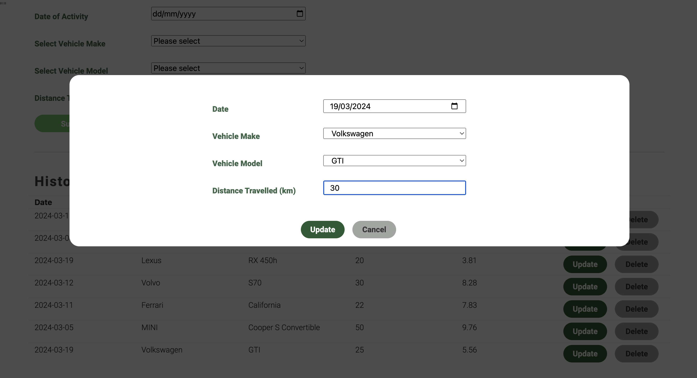
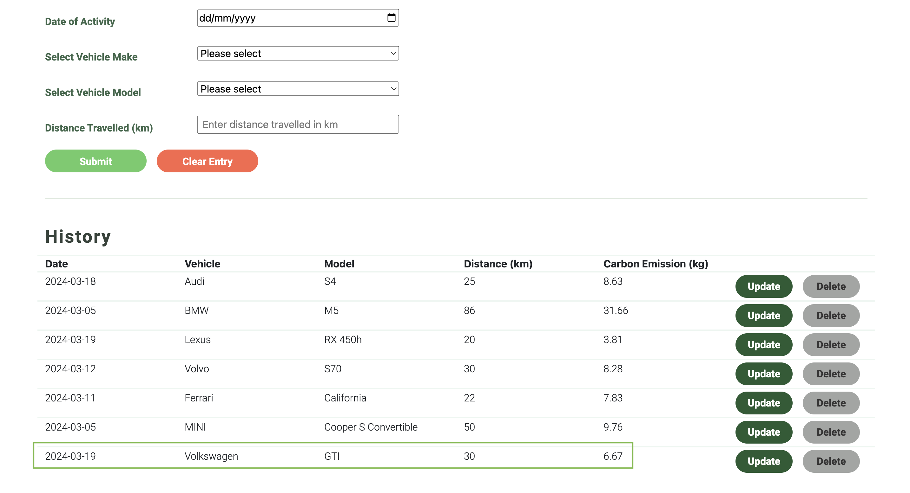

# CARBON FOOTPRINT TRACKER

The Carbon Footprint Tracker aims to drive environmental sustainability, creating greater awareness about how our lifestyle choices, as simple as the mode of transportation and the make of vehicle chosen, impacts our planet.

This tracker takes into account the user's selected make and model of vehicle, as well as the distance travelled (in km), churning out an estimated amount of carbon emitted (in kg).

In the app, users will have an overview of their total mileage and carbon emission. If it is of any interest to the users, links to explore emission reduction projects to offset their carbon footprint is available on the app as well.

# Screenshot

- Main page: Providing a brief explanation about the science and methodology behind the API.
  

  ***

- Login page: A dummy login page to route users to the app's dashboard.
  

  ***

- User Dashboard: Illustrating the total distance travelled and the estimated carbon emission.
  

  ***

- Log New Entry: Users are able to log a new entry by selecting their vehicle's make, model, distance travelled in km and the date of activity.
  

  ***

---

---

- Display of Past Entries: New entries will be reflected upon submission.
  

  ***

- Update Past Entry: Users are able to update their inputs or change their selection. Upon clicking update, the carbon emission will be recalculated and reflected on the app.
  

  ***

# Technologies Used

- JavaScript (React.js)
- HTML
- CSS
- Third-party public API: [Carbon Interface](https://docs.carboninterface.com/#/)

# Getting Started

# Next Steps

- Future enhancement one...
- Future enhancement two...
