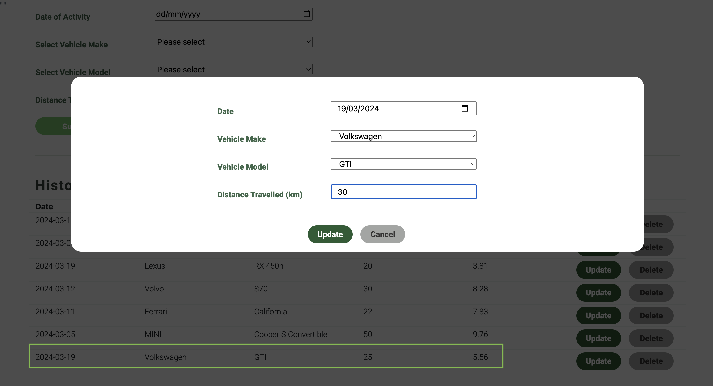
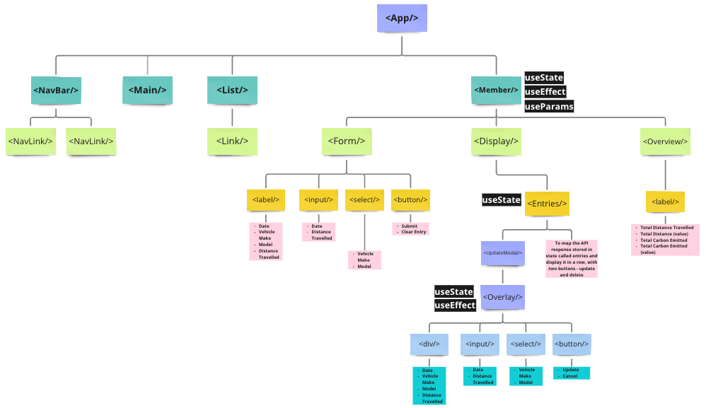

# CARBON FOOTPRINT TRACKER

The Carbon Footprint Tracker aims to drive environmental sustainability, creating greater awareness about how our lifestyle choices, as simple as the mode of transportation and the make of vehicle chosen, impacts our planet.

This tracker takes into account the user's selected make and model of vehicle, as well as the distance travelled (in km), churning out an estimated amount of carbon emitted (in kg).

In the app, users will have an overview of their total mileage and carbon emission. If it is of any interest to the users, links to explore emission reduction projects to offset their carbon footprint is available on the app as well.

# Screenshot

- Main page: Providing a brief explanation about the science and methodology behind the API.
  

  ***

- Login page: A dummy login page to route users to the app's dashboard.
  

  ***

- User Dashboard: Illustrating the total distance travelled and the estimated carbon emission.
  

  ***

- Log New Entry: Users are able to log a new entry by selecting their vehicle's make, model, distance travelled in km and the date of activity.

Using the Carbon Interface API, users are able to select from a wide range of vehicle make

---

Only upon selection of the vehicle's make, the vehicle model dropdown will render to display only the models associated with the selected make.

---

---

- Display of Past Entries: New entries will be reflected upon submission.
  

  ***

- Update Past Entry: Users are able to update their inputs or change their selection. Upon clicking update, the carbon emission will be recalculated and reflected on the app.
  

  ***

# Technologies Used

- JavaScript
- ReactJS, ReactDOM, React Router
- HTML
- CSS
- Third-party public API: [Carbon Interface](https://docs.carboninterface.com/#/)
- Airtable: used as a database for CRUD operations

# Getting Started

Critical Phases of the Project Implementation

- Research and decide on the public APIs available
- Create [User Stories](https://github.com/users/samanthatan01/projects/1) on github
- Planning the hierarchy and dataflow of the app (refer to image below for the App's hierarchy)
- Deployment
  

# Next Steps

- To expand the mode of transportation to include flight and shipping estimates
- To build a functional user login page
- To work on a functional DELETE button for the entries submitted

# Citations

-
